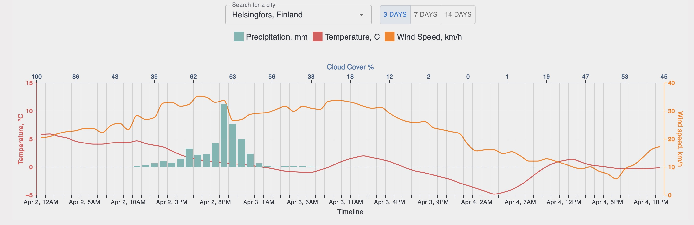

## GraphQL weather forecast client application
It supports weather forecast in range from 1 to 16 days.
Make sure [server](https://github.com/lappi-lynx/weather_widget_api) is running first!

### Installation and running

```
docker build --no-cache -t forecast_client .
docker run --rm -p 3333:3333 forecast_client
```

### Embedding
```
<script>
    function injectWeatherWidget(theme = 'dark') {
      var iframe = document.createElement('iframe');
      // client app url
      iframe.src = `http://localhost:3333/forecast?theme=${theme}`;
      iframe.width = '100%';
      iframe.height = '100%';
      iframe.frameBorder = '0';
      iframe.style.border = 'none';
      iframe.style.width = '100%';
      iframe.style.minHeight = '450px';
      document.getElementById('weatherWidgetContainer').innerHTML = '';
      document.getElementById('weatherWidgetContainer').appendChild(iframe);
    }

    function toggleTheme() {
      var body = document.body;
      body.classList.toggle('dark');
      var theme = body.classList.contains('dark') ? 'dark' : 'light';
      injectWeatherWidget(theme);
    }

    window.addEventListener('DOMContentLoaded', function() {
      injectWeatherWidget('dark');
    });
  </script>

  <button onclick="toggleTheme()">Switch theme</button>
```
### Theme support
`dark` (by default) and `light` themes supported


